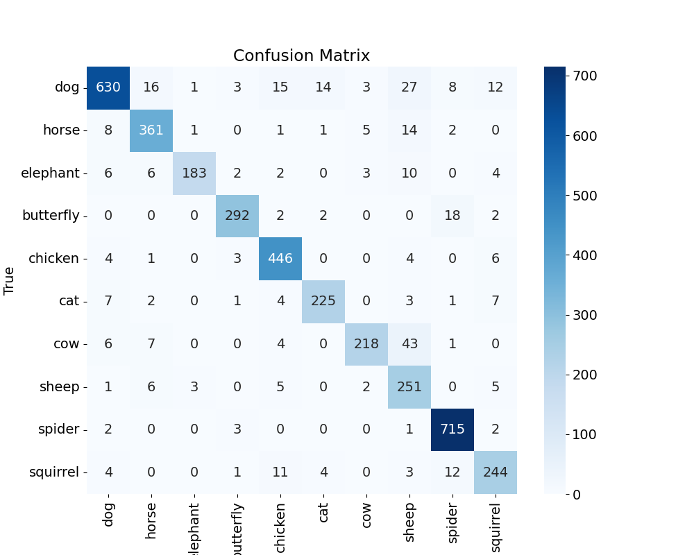

# Animals Classification on Animals-10 Dataset using VGG16

This project is a Flask web application for classifying animal images into 10 categories using a pre-trained VGG16 model. The dataset used for this project consists of approximately 28,000 medium-quality animal images belonging to the following categories: dog, cat, horse, spider, butterfly, chicken, sheep, cow, squirrel, and elephant.

## Table of Contents

- [Dataset Details](#dataset-details)
- [Getting Started](#getting-started)
  - [Prerequisites](#prerequisites)
  - [Installation](#installation)
- [Usage](#usage)
- [Customization](#customization)
- [Results](#results)
- [License](#license)
- [Acknowledgments](#acknowledgments)

## Dataset Details

This dataset was used for a matriculation thesis and contains approximately 28,000 medium-quality animal images categorized into 10 classes:

- Dog
- Cat
- Horse
- Spider
- Butterfly
- Chicken
- Sheep
- Cow
- Squirrel
- Elephant

The images have been collected from "Google Images" and have been manually reviewed for quality. Some erroneous data has been intentionally included to simulate real-world conditions, such as images taken by users of your app.

For more details and to access the dataset, you can visit the following link: [Animals-10 Dataset on Kaggle](https://www.kaggle.com/datasets/alessiocorrado99/animals10)

## Getting Started

Follow the steps below to get the web application up and running on your local machine.

### Prerequisites

Before you begin, ensure you have the following prerequisites installed on your system:

- Python 3.x
- Flask
- TensorFlow (for the VGG16 model)

You can install the required Python packages using pip:

```bash
pip install Flask tensorflow
```

### Installation

1. Clone this repository to your local machine:

```bash
git clone https://github.com/pypi-ahmad/Animals-classification-on-Animals-10-dataset-using-VGG16.git
```

2. Change to the project directory:

```bash
cd Animals-classification-on-Animals-10-dataset-using-VGG16
```

3. Install project dependencies using `requirements.txt`:

```bash
pip install -r requirements.txt
```

4. Run the Flask app:

```bash
python app.py
```

The app should now be accessible at http://127.0.0.1:5000/ in your web browser.

## Usage

1. Open the app in your web browser.
2. Click the "Upload an image for classification" button.
3. Choose an image file for classification.
4. Click the "Classify" button.
5. The app will display the predicted animal class for the uploaded image.

## Customization

You can customize the app to fit your specific needs:

- **Replace the Model**: If needed, replace the "my_model.h5" file with your custom-trained model.
- **Update Class Labels**: Modify the class labels in `app.py` to match your classification problem.
- **Enhance User Interface**: Customize the HTML templates in the "templates" folder to improve the user interface.

## Results

### Accuracy Curve


### Loss Curve


### Confusion Matrix



### Accuracy, Precision, and Recall


## License

This project is licensed under the MIT License - see the [LICENSE](LICENSE) file for details.
